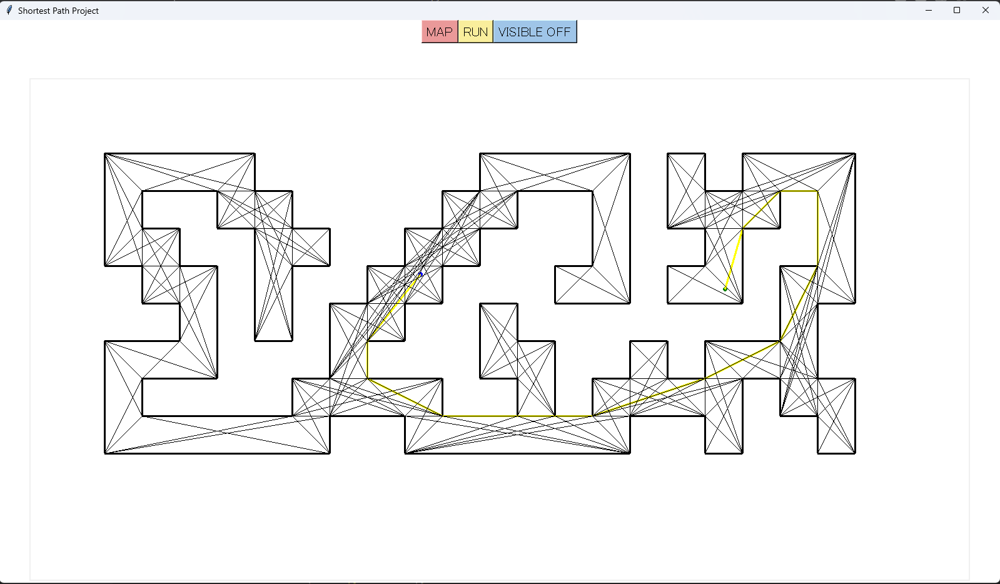

# Dijkstra Application
Pathfinding on a polygonal map between 2 given points using Dijkstra alogirthm, written in Python with the Tkinter UI library.
#### Video Demo:  <[URL HERE](https://youtu.be/PO4cLDIQ-iU)>
#### Description:
+Install numba and shapely
  
+run the app
  
## Illustration:
  

